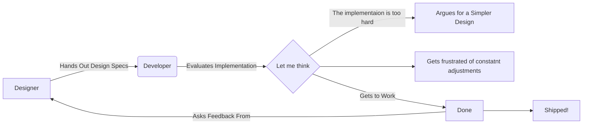
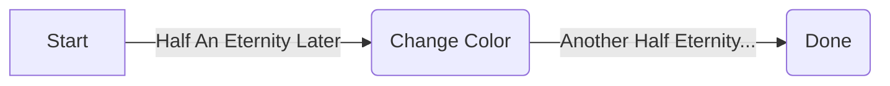
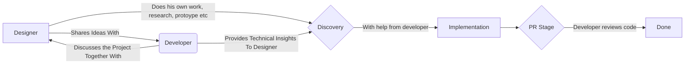
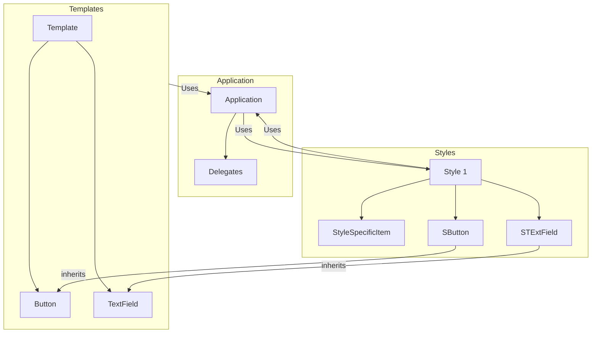

# Taking Qt Quick Controls 2's Templates and Styles to the Next Level

👨‍💻 Furkan Uzumcu | [zmc.space](https://zmc.space)

---
transition: fade-out
layout: center
---

# Let's Start with a Story

---
layout: two-cols
transition: fade-out
layoutClass: gap-16
level: 1
---

# This is Kyle


::right::

- Kyle Loves to Design
> And he's great at it!

<!--
- He also loves
    + pottery
    + biking
    + camping
- He cares about
    + the user experience
    + that pixel perfect design
    + the harmony of colors
-->

---
layout: two-cols
transition: fade-out
layoutClass: gap-16
level: 1
---

# This is Dorothy


::right::

- Dorothy Loves to Program
> And she's great at it!

<!--
- She also loves
    + Warhammer figurine painting
    + cosplaying
    + rock climbing
    + hiking
- She cares about:
    + solving problems
    + working on code
    + efficient solutions
    + good software architecture.
-->

---
level: 1
transition: fade-out
---

# What do they have in common?

They both:

- Love their work
- Want to deliver value

<!--
- It may feel like designers and developers want different things. But they don't. We just want it
  done in different ways.
-->

---
level: 1
transition: fade-out
layout: center
---

# Dorothy and Kyle Work Together

---
level: 1
transition: fade-out
layout: center
---

# And they will build a todo app!


> Design Credit: Dua-e-Zehra Rizvi, https://dribbble.com/shots/23117193-Todo-App
>
> Simple implementation on GitHub: https://github.com/Furkanzmc/qt-toronto-2024-templates-styles/tree/master/sample_app

---
level: 1
transition: fade-out
---

**Working Together?**



---
level: 1
transition: fade-out
---

# How it feels like to implement design changes for a developer

<div grid="~ cols-2 gap-4">

<div>



</div>

<div>


</div>

</div>

<!--
- You can sometimes tell that developer productivity gets reduced when doing design work.
-->

---
level: 1
transition: fade-out
layout: center
---

# What is the ideal flow?

---
level: 1
transition: fade-out
layout: center
---

# 👨‍🎨  ❤️  👩‍💻  =  🤩   🧑‍💻  👩‍🎨  🛒

<!--
- Both have unique perspectives 
- Collaboration = Better design
- So we need an interaction between them.
- Best results in our team usually comes from that.
-->

---
level: 1
transition: fade-out
---

# What is the goal?

- Enable people to do their best work
- `#include` people!
- Empower designers to work freely
- Increase developer happiness

---
level: 1
transition: fade-out
---

# How about this?



---
layout: center
transition: fade-out
---

What enables this workflow is <span v-mark.red="0">templates and styles architecture</span>

---
level: 1
transition: fade-out
---

<div grid="~ cols-2 gap-4">

 <!-- { --> <div>

# What is a template?

<div v-click>

- Base class that implements behavior and data flow
- Provides customization points for the style
- Provides data needed for visual styling

</div>

<!-- } --> </div>

<!-- { --> <div>

<div v-click>

# What is a style?


- Responsible for visualizing information
- Uses customization points from templates

</div>

</div>

<!-- } --> </div>

---
level: 1
transition: fade-out
---

# High Level Architecture

<style>
.flowchart {
    display: block;
    margin-left: auto;
    margin-right: auto;
    width: 70%;
}
</style>

<div class="mermaid flowchart">



</div>

---
level: 1
transition: fade-out
---

# High Level Folder Structure

```
├── qml
   ├── Templates # This is where the UI controls that need UX design go
   │  └── Todo
   │     ├── Dashboard
   │     ├── Tasks
   │     └── Window
   ├── Styles # This is where the visual implementation of the templates go
   │  └── Todo
   │     ├── Dashboard
   │     ├── QtQuickControls (*)
   │     ├── Tasks
   │     └── Window
   └── Todo # This is where any non-visual control, or data binding code go
      ├── Delegates
```

---
level: 1
transition: fade-out
---

# How does it work?

- Qt Quick Control style selection is handled by [Qt](https://doc.qt.io/qt-6/qtquickcontrols-customize.html)
- Use `QQuickStyle::setStyle` and `QQuickStyle::setFallbackStyle`
- Non Qt Quick Controls style selection:

<div grid="~ cols-2 gap-2">

<div>

```cpp
struct QmlFileInfo {
  QString typeName{""};
  QString fileName{""};
  int majorVersion{-1};
  int minorVersion{-1};
  bool isSingleton{false};
  bool isInternal{false};
};

// `importPath` depends on the style and
// the module we are importing
qmlRegisterType(
    QUrl::fromLocalFile(file.fileName()),
    importPath.toStdString().c_str(), info.majorVersion,
    info.minorVersion, info.typeName.toStdString().c_str());
```

</div>

<div>

```qmldir
module Styles.Todo.Tasks

TaskCard 1.0 TaskCard.qml
```

</div>

</div>

---
level: 1
transition: fade-out
---

# Real World Examples

<video autoplay loop controls>
  <source src="/assets/alias-onboarding-demo.mp4" type="video/mp4">
</video>

<!--
- Dorothy implemented this with minimal help from me. I reviewed her code, helped her structure it,
  and the feature was implemented by her, the way she wanted. She still maintains it and adds new
  things when needed.
-->

---
transition: fade-out
level: 1
---

# Real World Examples


---
transition: fade-out
level: 1
---

# Real World Examples


---
level: 1
transition: fade-out
---

# Code Sample

<div grid="~ cols-3 gap-2">

<div v-click>
<div>

```qml
// qml/main.qml
import Todo.Tasks
Window {
    TaskCard {
        text: "Just do it!"
        startDate: "14.05.2024 17:00"
        endDate: "14.05.2024 17:30"
        duration: "30 Minutes"
        anchors.centerIn: parent
    }
}
```

- Uses <span v-mark.red="0">style agnostic</span> import statements

</div>
</div>

<div v-click>

<div>

```qml
// qml/Templates/Todo/Tasks/TaskCard.qml
import QtQuick
import QtQuick.Templates as T

T.Control {
    property string text
    property string startDate
    property string endDate
    property string duration

    property Item startDateLabel
    property Item endDateLabel
    property Item durationLabel
}
```

- <span v-mark.red="0">Cannot</span> import any style code
- Implements behavior and data flow
- Could also be written in C++

</div>
</div>

<div v-click>

<div>

```qml
// qml/Styles/Todo/Tasks/TaskCard.qml
import QtQuick
import Templates.Todo.Tasks as T
import Styles.Todo // For Theme

T.TaskCard {
    startDateLabel: lbStartDate
    endDateLabel: lbEndDate
    durationLabel: lbDuration
    background: Rectangle {
        radius: 16
        color: privates.background
    }
    contentItem: Column {
        Label { id: lbStartDate }
        Label { id: lbEndDate }
        Label { id: lbDuration }
    }
```

- Imports templates
- <span v-mark.circle.orange="0">Doesn't</span> implement behavior

</div>
</div>

</div>

---
level: 1
transition: fade-out
---

<div grid="~ cols-2 gap-6">

<div>

# Pros


- Ability to change design without affecting other parts of the code
- Ability to set back up styles
- Less overwhelming for designer
- Bugs are usually visual, instead of behavioral
- Developers don't need to deal with design implementation

</div>

<div v-click>
<div>

# Cons


- It takes a while to get used to it
- Confusion about what goes where
- Increased number of files
- Potentially more `QObject` instantiations, may not be suitable for embedded (*)

> \* I didn't test this.

</div>
</div>

</div>

<!--
- We change the default style to Alias style bit by bit
-->

---
level: 1
transition: fade-out
layout: center
---

# Live Demo

---
level: 1
transition: fade-out
layout: center
---

# Some Best Practices

---
level: 1
transition: fade-out
---

# A template should stand on its own

<div grid="~ cols-2 gap-10">

<div>

```qml
// qml/Templates/Todo/Bad.qml
Item {
    property Item contentItem

    signal somethingHapened()

    onSomethingHappened: {
        // Works... But BAD!
        const data = root.myStyleProperty
    }
}
```

</div>

<div>

```qml
// qml/Styles/Todo/Bad.qml
Item {
    property int myStyleProperty

    contentItem: Label { }
}
```

</div>

</div>

---
level: 1
transition: fade-out
---

# Don't import style specific code

<div grid="~ cols-2 gap-6">

<div>

```qml
// qml/Templates/Todo/Bad.qml
import Styles.Todo
import Styles.Todo.Tasks

Item {
    property Item contentItem

    signal somethingHapened()

    onSomethingHappened: {
        // Works... But BAD!
        contentItem.color = Theme.error
    }

    // Works... But BAD!
    TaskList { }
}
```

</div>

<div>

```qml
// qml/Templates/Todo/Bad.qml
import Todo.Tasks

Item {
    property Item contentItem
    property bool hasError

    signal somethingHapened()

    onSomethingHappened: {
        root.hasError = true
    }

    TaskList { }
}
```

</div>

</div>

---
transition: fade-out
---

# Template Should Not Declare Visual Components

<div grid="~ cols-2 gap-6">

<div>

```qml
// qml/Templates/Todo/Bad.qml
Control {
    // BAD!
    background: Rectangle {
        color: "red"
    }
}
```

</div>

<div>

```qml
// qml/Templates/Todo/Bad.qml
Control {
    // BAD!
    onBackgroundChanged: {
        background.color = "red"
    }
}
```

</div>

</div>

---
level: 1
transition: fade-out
---

# Take advantage of Qt Quick Controls

```qml
// qml/Templates/Todo/Tasks/TaskCard.qml
import QtQuick
import QtQuick.Templates as T

T.Control {
    id: root
    // T.Control already establishes many patterns like `contentItem`, `background`
    // and `padding` values to save you time.
}
```

---
level: 1
transition: fade-out
---

# Use `Connections` and `Binding`s

<div grid="~ cols-2 gap-4">

<div>

```qml
// qml/Templates/Todo/Tasks/TaskCard.qml
import QtQuick
import QtQuick.Templates as T

T.Control {
    id: root

    property Item startDateLabel

    Binding {
        target: root.startDateLabel
        property: "text"
        value: root.startDate
    }
}
```

</div>

<div>

```qml
// qml/Templates/Todo/Tasks/TaskCard.qml
import QtQuick
import QtQuick.Templates as T

T.Control {
    id: root

    property T.CheckBox checkBox

    Connections {
        target: root.checkBox

        function onToggled() { }
    }
}
```

</div>

</div>

<!--
- `Binding` and `Connections` type will check for existance of signals and properties.
-->

---
level: 1
transition: fade-out
---

# Customization with properties

```qml
// qml/Templates/Todo/TaskCard.qml
T.Control {

    property Item interactionArea

    MouseArea {
        anchors.fill: root.interactionArea
        onDoubleClicked: {
            // Complete the task
        }
        onPositionChanged: {
            // Logic to adjust priority?
        }
    }
}
```

---
layout: center
---

# Thank you!


